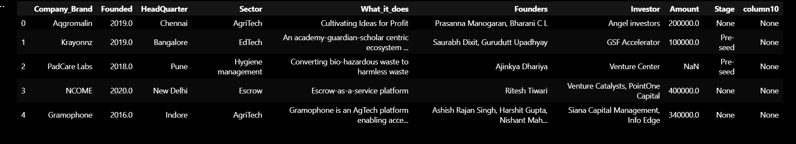
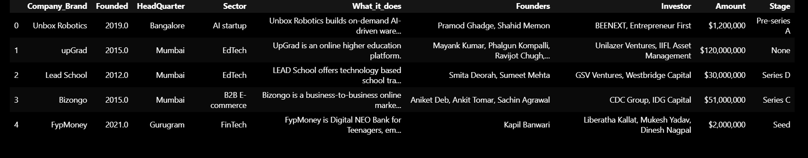
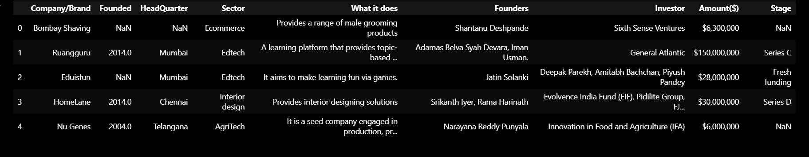
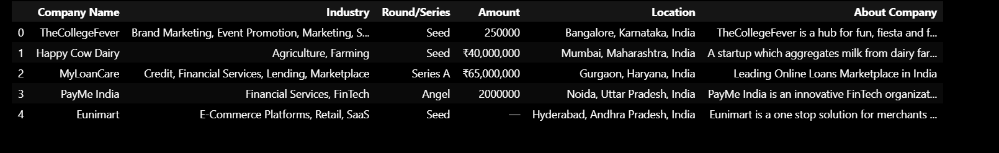
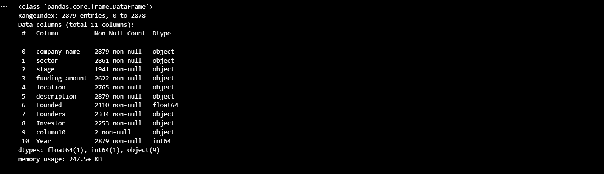
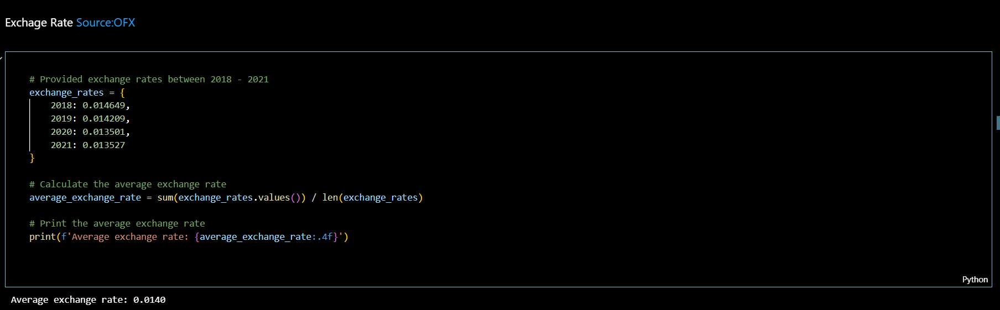
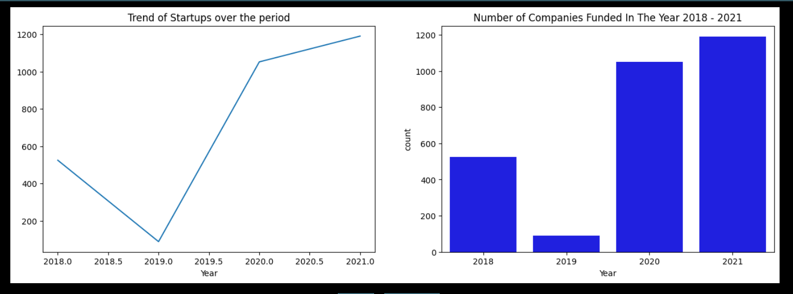
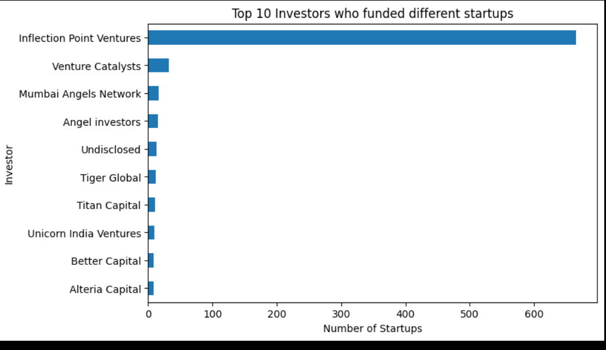
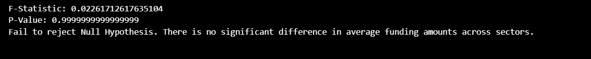

### Indian-Start-up-Investment-Analysis - LP1

# 1. Project Overview
In this project, I explore the dynamic landscape of start-up funding in India from 2018 to 2021. My goal is to uncover key patterns, trends, and insights that characterize the investment ecosystem during these years. The dataset for this analysis was gathered from three different sources:


*First dataset*:  The data for 2020 and 2021 were saved in Microsoft SQL Server.

*Second dataset*: The data for 2019 were saved in OneDrive.

*Third dataset*: The data for 2018 were stored in GitHub repository.


# 2. Case Study


**Scenario**

Your team is trying to venture into the Indian start-up ecosystem. As the data expert of the team you are to investigate the ecosystem and propose the best course of action.


# 2.1 Ask


In this phase, I outline the business objectives, create hypotheses, and ask questions to support or refute these ideas. In addition, I hope to glean broad insights from the data.


# 2.2 Business Task

My main task is to analyse Indian start-up data in order to deliver relevant insights and answers to my team looking to enter the Indian start-up ecosystem. I would like to emphasise key metrics and considerations that will inform and guide their decisions before entering this dynamic market.


# 3. Hypothesis Testing
### Null Hypothesis (H0): 
 There is no significant difference in the average funding amounts received across different sectors within the Indian startup ecosystem from 2018 to 2021.

 ### Alternative Hypothesis (H1):
There is a significant difference in the average funding amounts received across different sectors within the Indian startup ecosystem from 2018 to 2021.

# 4. Business Questions

(4.1)  Analyze the growth trajectory of startups over the past four years from 2018 to 2021. Investigate if there is an increase in the number of startups being funded and the average size companies of funded annually.


(4.2) Investigate the financial landscape for Indian startups over the four years. Has the average funding amount increased, indicating growing investor confidence, or has it plateaued or decreased overtime?

(4.3) Identify the booming sectors withing the ecosystem and which top city serves as the industrial hub in India.

(4.4) Determine the top investors within the startup ecosystem and identify the proportion of investment by the first 3 investors that have funded different sectors from 2018 - 2021

(4.5) Explore which stages of startups (e.g., Seed, Series A, Series B) are receiving the majority of investments. What are the predominant stages funded, and which cities are the identified stages of business situated.


# 5. Deliverables
- A hypothesis.

- Questions to help gain insights into the data. A summary of the Analysis.

- Visualizations to communicate findings.

- Recommendations based on the analysis.


# 6. Data Preparation and Quality Checks
During this step, I collected data from several sources for the analysis.


# 7. Information on Data

The data for the project was provided by Azubi Africa (Trainers). The data contains 4 csv files: data_2018.csv, data_20192.csv, data_2020 (from SQL server) and data_2021 (also from SQL server)


### 7.1 The columns in the dataset are as follows:

- Company Name: The name of the company.
- Founded: The year the company was founded.
- Sector: The sector the company operates in.
- Stage: The funding stage of the company.
- Location: The location of the company’s headquarters.
- Amount: The amount of funding the company received.
- Description: The ‘The About of company’.
- Investor: The investor who funded the company.
- Founder: The founders of the company.


### 7.2 Limitations of the Data

The 2018 start-up data lacks two columns (Founders, Founded) that are present in the 2019, 2020, and 2021 datasets. It is important to note that the source of the 2018 dataset is unknown, and therefore, this data cannot be considered reliable for making real-life recommendations for entrepreneurs.


# 8. Data Selection

For the purpose of this study, all four datasets (2018-2021) were retrieved from their respective sources.


# 9. Tools for Analysis
The following tools were utilized:

- Python's:

- Pandas: For data manipulation and cleaning.

- NumPy: For numerical operations.

- Matplotlib and Seaborn: For data visualization.

- SQL: For querying and managing the 2020 and 2021 data stored in Microsoft SQL Server.

- GitHub: To access the 2018 dataset and manage version control for any scripts or notebooks used in the analysis.

- Jupyter Notebook: For interactive data analysis and sharing insights through well-documented notebooks.


# 10. Process
In this face, I preview all the 4 dataset to understand the structure

### 10.1 Imported relevant Libraries

```
import pyodbc
from dotenv import dotenv_values
import pandas as pd
import warnings
import numpy as np

warnings.filterwarnings('ignore')
```


### 10. Establish a connection to the server
.png>)


### 10.3 Preview Data_2020

```
query= "SELECT * FROM dbo.LP1_startup_funding2020"
data_2020 =pd.read_sql(query, connection)

data_2020.head()
```



### 10.4 Data_2021

```
query= "SELECT * FROM dbo.LP1_startup_funding2021"
data_2021 =pd.read_sql(query, connection)

data_2021.head()
```



### 10.5 Data_2019

``` data_2019=pd.read_csv("D:\\JHanson\\Justice Hanson\\DS Career Accelerator\Project 1\\Indian-Start-up-Investment-Analysis\\CSV Data\\startup_funding2019.csv")

data_2019.head(5)
```



### 10.6 Data_2018



### 10.7 Checking for consistency, Renaming the colums before merging them

```
data_2018.rename(columns={
    'Company Name': 'company_name',
    'Industry': 'sector',
    'Round/Series': 'stage',
    'Amount': 'funding_amount',
    'Location': 'location',
    'About Company': 'description'
}, inplace=True)

# 2019 column mapping
data_2019.rename(columns={
    'Company/Brand': 'company_name',
    'HeadQuarter': 'location',
    'Sector': 'sector',
    'What it does': 'description',
    'Amount($)': 'funding_amount'
}, inplace=True)

# 2020 column mapping
data_2020.rename(columns={
    'Company_Brand': 'company_name',
    'What_it_does': 'description',
    'Amount': 'funding_amount'
}, inplace=True)

# 2021 column mapping
data_2021.rename(columns={
    'Company_Brand': 'company_name',
    'What_it_does': 'description',
    'Amount': 'funding_amount'
}, inplace=True)

# Merge datasets using the standardized column names
merged_data = pd.concat([data_2018, data_2019, data_2020, data_2021], ignore_index=True)

merged_data.head(5)
```

This helped in having a consistent column names for the merged dataset


### 10.7 created new column 'Year

purposely to identify each of the 4 datasets withing the merged_data

### 11.1 check data info to understand data structure


## 11.2 Dataset Overview
- Total Entries: 2,879
- Total Columns: 10

## Missing Values Analysis

- company_name: 2,879 non-null (no missing values)
- sector: 2,861 non-null (18 missing values)
- stage: 1,934 non-null (945 missing values)
- funding_amount: 2,312 non-null (567 missing values)
- location: 2,879 non-null (no missing values)
- description: 2,879 non-null (no missing values)
- Founded: 2,110 non-null (769 missing values)
- Founders: 2,334 non-null (545 missing values)
- Investor: 2,246 non-null (633 missing values)
- Year: 2,879 non-null (no missing values)


# 12. Cleaning Approach - Column CLeaning

**sector column**

- Print all unique values in the column to check errors and anomalities


It was observed the sector column had a lot of reapeted sector names with different value characteristcs, hence appearing to be unique, the values were mixed up with upper case values, lower case values, wrong puntuations, spelling errors

Approach to observation - Sector mapping

This ensured I have consistency in the sector column for all sector analyses, while all other erros and irregularities were replaced with pd.NaN

## Amount Column

Print all value characteristics to understand the amount by printing all the unique values.

```
'''All unique values in amount column was printed to detect characteristics of the values below'''

# Additional characteristics to count
characteristics = ['—', '\$', '\$Undisclosed', 'Undisclosed', 'None', 'nan', 'Series C', 'Seed', 'Pre-series A', '₹']

# Initialize counts dictionary
counts = {char: 0 for char in characteristics}

# Count occurrences of each characteristic
for characteristic in characteristics:
    if characteristic in {'—', '\$', '\$Undisclosed', 'Undisclosed', 'None', 'nan', 'Series C', 'Seed', 'Pre-series A', '₹'}:
        count = merged_data['funding_amount'].astype(str).str.contains(characteristic, regex=True, na=False).sum()
    else:
        count = merged_data['funding_amount'].astype(str).str.contains(f"\\b{characteristic}\\b", regex=True, na=False).sum()
    counts[characteristic] = count

# Count occurrences of numeric values
numeric_count = merged_data['funding_amount'].notnull().sum()

# Print counts
for characteristic, count in counts.items():
    print(f'{characteristic} - {count}')
print(f'Numeric values - {numeric_count}')
```


- Values ['Series C', 'Seed', 'Pre-series A'] indicates wrong enteries, they were pushed to their respective column 'stage column'
- All dollar symbols were dropped
- The dahes '-' were dropped and replaced with nan
- All values with rupee symbols where converted to dollors by multiplying the respective values by the average exchange rate




The corrections in amount column was done using the code:

```
# Define the exchange rate
exchange_rate = 0.0140

# Replace '—' in funding_amount with np.nan
merged_data['funding_amount'].replace('—', np.nan, inplace=True)

# Replace 'None' with np.nan
merged_data['funding_amount'].replace('None', np.nan, inplace=True)

# Convert funding_amount to string type
merged_data['funding_amount'] = merged_data['funding_amount'].astype(str)

# Remove dollar symbol and commas, then convert to float
merged_data['funding_amount'] = merged_data['funding_amount'].str.replace('$', '', regex=False)
merged_data['funding_amount'] = merged_data['funding_amount'].str.replace(',', '', regex=False)

# Convert Rupee values to USD and remove the rupee symbol
merged_data['funding_amount'] = merged_data['funding_amount'].apply(
    lambda x: float(x.replace('₹', '')) * exchange_rate if isinstance(x, str) and '₹' in x else x
)

# Convert funding_amount to float type
merged_data['funding_amount'] = pd.to_numeric(merged_data['funding_amount'], errors='coerce')
```


### Location column

- Printed all unique values

- Identify wrong values and anomalities

- Corrected spelling errors for consistency


- The remaining columns followed the same approcah in cleaning and removing all anomalities

- Columns 'Founders and Founded' were both dropped from merged DataFrame as it was not relevant to the analysis and objectives.

# Handle Missing Values in Merged DataFrame

- impute missing categorical values with mode
- forward fill on missing values in stage column
- median fill on the amount of missing values


# 13. Explored data and answered Analytical Questions






# 14. Test Hypothesis at 95% confidence level

**Null Hypothesis** (H0): There is no significant difference in the average funding amounts received across different sectors within the Indian startup ecosystem from 2018 to 2021.

**Alternative Hypothesis** (H1): There is a significant difference in the average funding amounts received across different sectors within the Indian startup ecosystem from 2018 to 2021.


```
import scipy.stats as stats

# Extract funding amounts for each sector
sector_funding = [merged_data[merged_data['sector'] == sector]['funding_amount'] for sector in merged_data['sector'].unique()]

# Perform one-way ANOVA
f_statistic, p_value = stats.f_oneway(*sector_funding)

alpha = 0.05

# Print the results
print("F-Statistic:", f_statistic)
print("P-Value:", p_value)

# Check for significance
if p_value < alpha:
    print("Reject Null Hypothesis. There is a significant difference in average funding amounts across sectors.")
else:
    print("Fail to reject Null Hypothesis. There is no significant difference in average funding amounts across sectors.")
```


- Failed to reject null hypothesis and conclude with 95% confidence that average funding amount do not vary across the sectors.

# Recommendation


Based on the observations on the Indian startup ecosystem, here are some informed recommendations for the team to consider to make informed decision:

1. Stay Resilient and Adaptable: The Indian startup ecosystem has shown resilience and potential for growth, even in the face of challenges like the economic uncertainty associated with the COVID-19 pandemic. The team should be prepared to navigate uncertainties and adapt strategies as needed.

2. Focus on High-Growth Sectors: The booming sectors within the Indian startup ecosystem, such as FinTech, EdTech, Finance, E-Commerce, and SaaS, present lucrative opportunities for investment and innovation. The team should consider these sectors to capitalize on the growing demand and investor interest.

3. Location Strategy: Bangalore emerges as the industrial hub in India, with a high concentration of startups, particularly in the FinTech sector. The team should consider establishing a presence in Bangalore to tap into the vibrant startup ecosystem and access talent, resources, and networking opportunities.

4. Strategic Partnerships with Top Investors: The team is encouraged to form strategic partnerships with top investors like Inflection Point Ventures, Venture Catalysts, and Mumbai Angels Network. These investors have a proven track record of funding successful startups across diverse sectors and can provide valuable insights, mentorship, funding opportunities.

5. Focus on Series B Investments: Given the preference of top investors for Series B investments, the team should consider targeting startups at this stage for investment or partnership opportunities. Series B startups have typically proven their business model and are ready to scale, offering lower risk and significant growth potential.
